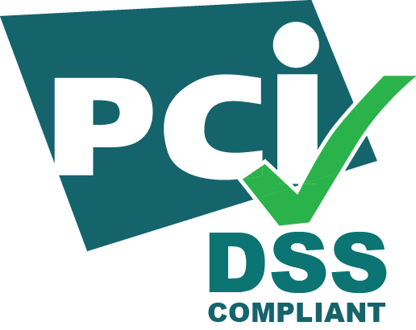

# Unified Compliance Hub for ISO 27001 and PCI DSS  

  
*A unified platform to simplify ISO 27001 and PCI DSS compliance management.*  

---

## 📜 Table of Contents  
- [Project Overview](#project-overview)  
- [Key Features](#key-features)  
- [Technologies Used](#technologies-used)  
- [Architecture](#Architecture)  
- [Installation](#Installation)  
- [Usage](#Usage)    
- [License](#License)  
- [Roadmap](#Roadmap)  
  

---

## 🚀 Project Overview
This project simplifies compliance with **ISO 27001:2022** and **PCI DSS v4.0** by unifying their requirements into a single framework. The platform automates compliance assessments, prioritizes risks, and provides real-time tracking through an intuitive dashboard. Designed for medium-sized businesses, it reduces redundant efforts and streamlines audit preparation.  

---

## 🔑 Key Features
1. **Unified Compliance Framework**  
   - Mapped controls for ISO 27001 and PCI DSS to eliminate redundancy.  
2. **AI-Powered Risk Prioritization**  
   - ML-driven prioritization of compliance gaps by severity.  
3. **Interactive Dashboard**  
   - Real-time compliance score, risk breakdown charts, and policy drill-downs.  
4. **Automated Reporting**  
   - Generate ISO 27001 SoA, PCI DSS SAQs, and gap analysis reports with one click.  

---

## 🛠️ Technologies Used
### Frontend  
- **HTML5**, **CSS3**, **JavaScript** (Vanilla-js/jQuery) 
- **Bootstrap 5** (responsive design)  
- **Chart.js** (visualizations)  

### Backend  
- **Python** with **FastAPI** (REST API)  
- **SQL Database** (PostgreSQL)  

### AI/ML  
- **ML** & **NLP** (For risk scoring and automated policy document analysis)  
   

### Tools  
- **Jinja2** (report templating)  
- **ReportLab** (PDF generation)  

---

## 🏗️ Architecture
```plaintext
Frontend (HTML/CSS/JS)  
  │  
  └─▶ Backend (FastAPI/Python)  
        │  
        ├─▶ Database (PostgreSQL)  
        └─▶ ML Model  
              │  
              └─▶ Compliance Data → Risk Scoring → Dashboard Updates  
```

---

## 📥 Installation 
### Prerequisites  
- Node.js (for frontend dependencies)  
- Python 3.10+  
- PostgreSQL  

### Steps  
1. Clone the repository:  
   ```bash  
   git clone https://github.com/yourusername/compliance-hub.git  
   cd compliance-hub  
   ```  
2. Install frontend dependencies:  
   ```bash  
   npm install bootstrap chart.js  
   ```  
3. Set up Python virtual environment:  
   ```bash  
   python -m venv venv  
   source venv/bin/activate  # Linux/macOS  
   venv\Scripts\activate     # Windows  
   pip install -r requirements.txt  
   ```  
4. Configure the database:  
   ```bash  
   python -m alembic upgrade head  
   ```  
5. Run the app:  
   ```bash  
   uvicorn main:app --reload  
   ```  

---

## 🖥️ Usage
1. **Dashboard Navigation**  
   - View the **compliance score** and **risk overview** in the header.  
   - Explore the **bar chart** for policy risk distribution.  
   - Click policies in the **compliance table** to drill down into details.  
2. **Generate Reports**  
   - Navigate to *Reports → Generate* and select a template (ISO/PCI).  
3. **AI Recommendations**  
   - Check the *Actionable Recommendations* panel for prioritized fixes.  

---

## 📄 License
This project is licensed under the **MIT License**. See [LICENSE](LICENSE) for details.  

---

## 🗺️ Roadmap
- **1st Milestone**: Develop frontend & backend.  
- **2nd Milestone**: Document extraction & Developement of a consolidated compliance
framework that maps and aligns ISO 27001 controls with corresponding PCI DSS
requirements, eliminating duplicate controls and efforts 
- **3rd Milestone**: Train & integrate the AI model 

---

